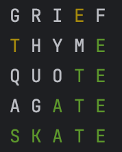
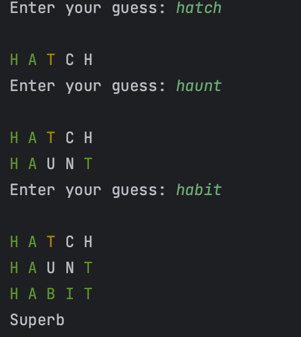

<link rel="stylesheet" href="https://cs.westminsteru.edu/~greg/styles.css">

<p id="header">CMPT 202 Homework #XXX<br>Wordle</p>


### Overview

Wordle is a spelling game where you try to guess a 5-letter word in 6 tries. If you don't know how to play Wordle, you will first need to <a href="https://www.wikihow.com/Play-Wordle" target="_blank"> learn the rules</a>. You can <a href="https://wordleplay.com/" target="_blank">play Wordle online</a>. It is important you know how to play Wordle prior to starting this assignment!

### The Game

The game begins by having the computer choose a random 5-letter word from its <a href="./wordle-words.txt" target="_blank">dictionary</a>. 
The following screenshot shows the game being solved for the word "SKATE":



The first guess is "GRIEF" which has the letter 'E', but is not in the correct position. The second guess is "THYME" which determines the correct position of 'E' and also there is a 'T', but not in the correct position. Guesses 3, 4, and 5 ultimately reach the correct answer of "SKATE".

Write a program that plays Wordle beginning with the github repository:

```
https://github.com/greggagne/202-wordle.git
```

### How to Begin

Most of your work will involve completing the `playGame()` method. Initially, develop an algorithm that compares the guess to the word. For example, if the Wordle word is "STORE" and the player enters "GROVE", the result is 


You will want to store each guessed word in the `guessedWords` array where each entry in the array contains an `ArrayList` of `Letter` objects. Each `Letter` is the:

1. character
2. color
3. position

in the guessed word.

The for loop demonstrates how to create different `Letter` objects:

```java
for (int i = 0; i < guess.length; i++) {
    if (i == 0 || i == 3) {
        guessedWords[attempts].add(new Letter(guess[i], Color.GREEN,i));
    }
    else if (i == 1 || i == 4) {
        guessedWords[attempts].add(new Letter(guess[i], Color.YELLOW,i));
    }
    else {
        guessedWords[attempts].add(new Letter(guess[i], Color.GRAY,i));
    }
}
```

This code selects characters at arbitrary positions with different colors, and should provide you with an example of how to create `Letter` objects with different (although arbitrary) colors.

This for loop demonstrates how to output the different guessed words:

```java
for (int i = 0; i < attempts; i++) {
    for (int j = 0; j < guessedWords[i].size(); j++) {
        guessedWords[i].get(j).print();
    }
    System.out.println();
}
```

Run the example program and familiarize yourself with its functionality before beginning to solve Wordle.

### Validating the Input

You must check if the player's guess is a valid word in the Wordle dictionary by performing a binary search which is called from the `validateGuess()` method.

### Solving Wordle

You will develop a solution to Wordle You will need to compare each letter in the guessed word to the Wordle word chosen by the computer and determine if each character in the guessed word

- matches by position (green letter);

- occurs elsewhere in the word (yellow letter);

- does not match (gray letter).

As an example. The random word is "TABLE" and the first guessed word is "STATE"

| 0 | 1 | 2 | 3 | 4 |
|----------|----------|----------|----------|----------|
| T    | A    | B    | L    | E    |
| S    | T    | A    | T    | E    |

Your program would color the letters as


Notice how the guessed word contains two 'T's, yet only one 'T' is colored yellow as 'T' only occurs once in "TABLE". This can be an algorithmic challenge as you want to make sure the second `T` in "STATE" does not also appear as yellow.

Here are a few challenging combinations to make sure your algorithm for coloring the guessed word works correctly:

| Wordle Word | Guess | 
|----------|----------| 
| TABLE    | S<span style="color: gold;">TA</span>T<span style="color: green;">E</span>    | 
| STALE    | <span style="color: green;">STA</span>T<span style="color: green;">E</span>    |
| DIGIT    | AL<span style="color: gold;">I</span>B<span style="color: gold;">I</span>    |
| ALIVE    | <span style="color: green;">ALI</span>BI    |
| SKATE    | AG<span style="color: green;">ATE  </span>  |

### Determining Win/Loss

If the player guesses the word in six or fewer tries, they win, otherwise they lose. The `attempts` variable can be used to keep track of the number of guesses the player makes, but determining a winner relies on ensuring all letters in the guessed word are colored green. The `checkStatus()` method will return true if the player has won and false otherwise.

An example of a winning output:



and a losing output (where the player did not play very well!):


### Hard Mode (Extra Credit)

A challenging way to play Wordle is known as **hard mode** where all letters that are green or yellow must be used in subsequent guesses:

- yellow letters can be shifted around to other positions;

- green letters must remain in place.

For example, if the Wordle word is "TREND" and the user guesses "DETER", the guessed word is


The player must now use the letters 'D','E','T','R' in subsequent guesses, but they can be used in any position.

If the player now guesses "TRADE", the guessed word becomes


where letters `T` and `R` must be used at the same positions and 'D' and 'E' can be used elsewhere.

Hard mode is played by entering the letter `H` as a parameter to the program.

### Submission

Submit your solution to Canvas by the due date. There is a grading rubric on the Canvas submission box for this assignment. 
